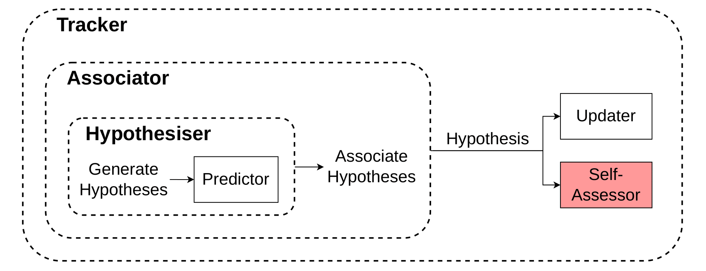
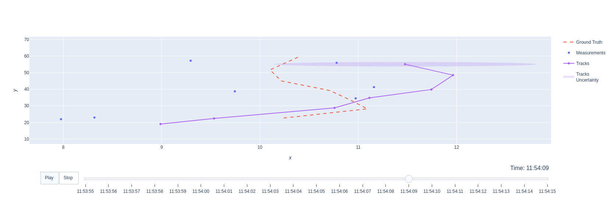
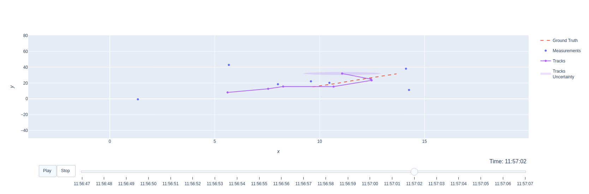
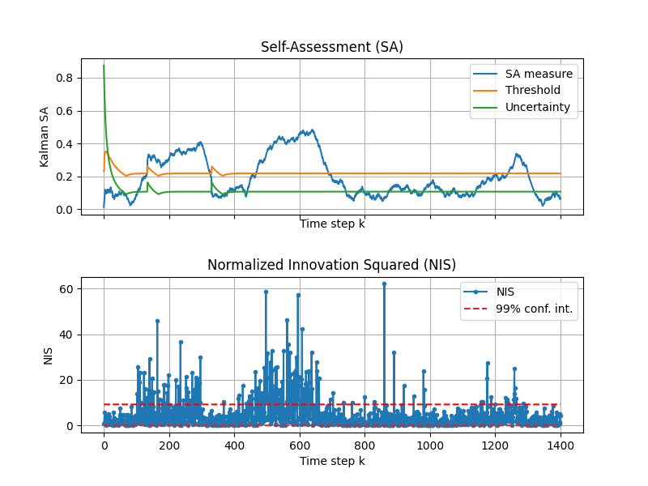
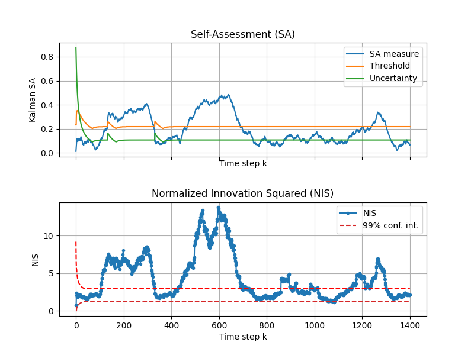

# Self-Assessment and Monitoring Module for Tracking Algorithms: Implementation in the Stone Soup Framework

This repository contains the implementation of self-assessment extensions for the Stone Soup framework. 
These extensions are part of our research, as described in our paper submitted to the FUSION 2025 conference.

## Overview

Our proposal introduces a Self-Assessment (SA) module, referred to as Self-Assessor, into the Stone Soup framework.



## Citation
If you find this repository useful in your research, please consider citing our work.   
*[The BibTeX entry will be updated if our FUSION 2025 paper is accepted.]* 

```
@misc{aduulmstonesoup2025,
    title={Self-Assessment and Monitoring Module for Tracking Algorithms: Implementation in the Stone Soup Framework},
    author={Griebel, Thomas and Buchholz, Michael and Dietmayer, Klaus},
    howpublished = {\url{https://github.com/uulm-mrm/aduulm-stonesoup}},
    year={2025}
}
```

The following publications are included in the self-assessment framework:

* [Kalman Filter Meets Subjective Logic: A Self-Assessing Kalman Filter Using Subjective Logic](https://doi.org/10.23919/FUSION45008.2020.9190520)
* [Self-Assessment for Single-Object Tracking in Clutter Using Subjective Logic](https://doi.org/10.23919/FUSION49751.2022.9841294)
* [Online Performance Assessment of Multi-Sensor Kalman Filters Based on Subjective Logic](https://doi.org/10.23919/FUSION52260.2023.10224188)

## Installation & Development Setup

To start developing with our self-assessment extensions, please use Python 3.12 and clone the appropriate branch:

```
git clone "https://github.com/uulm-mrm/aduulm-stonesoup.git"
cd Stone-Soup
python -m pip install -e ".[dev,aduulm]"
```

Make sure to check out our self-assessment extensions branch:
[selfassessment_extensions](https://github.com/uulm-mrm/aduulm-stonesoup/tree/selfassessment_extensions)

## Tutorials & Usage

If you want to experiment with the Self-Assessor, tutorials can be found here:

👉 [Self-Assessor Tutorials](https://github.com/uulm-mrm/aduulm-stonesoup/tree/selfassessment_extensions/aduulm_scripts/tutorials)

These tutorials allow you to:

 - Disturb and manipulate ground truth trajectories
 - Disturb and manipulate measurements
 - Obtain self-assessment results to detect disturbances

Please note that we are still in the process of refactoring and finalizing the code. Additional tutorials and corresponding self-assessor implementations will be uploaded shortly.

### Disturbance in Transition Model


### Disturbance in Measurement Model


### Self-Assessment: Kalman Self-Assessor and Single-Time Step NIS


### Self-Assessment: Kalman Self-Assessor and Time-Averaged NIS



--- Here begins the original Stone Soup README ---

The following section contains the unmodified README from the original Stone Soup project.

<h1> Stone Soup</h1>

[](https://pypi.org/project/stonesoup)
[](https://anaconda.org/conda-forge/stonesoup)
[](https://circleci.com/gh/dstl/Stone-Soup)
[](https://codecov.io/gh/dstl/Stone-Soup)
[](https://stonesoup.readthedocs.io/en/latest/?badge=latest)
[](https://gitter.im/dstl/Stone-Soup?utm_source=badge&utm_medium=badge&utm_campaign=pr-badge&utm_content=badge)
[](https://doi.org/10.5281/zenodo.4663993)

## Background
Stone Soup is a software project to provide the target tracking and state estimation
community with a framework for the development and testing of tracking and state
estimation algorithms.

An article is [available](https://www.gov.uk/government/news/dstl-shares-new-open-source-framework-initiative) that details the background to the project, and contains links to sample data.

Please see the
[Stone Soup documentation](https://stonesoup.readthedocs.org/) for more
information.

Please see the [tutorials](https://stonesoup.readthedocs.io/en/latest/auto_tutorials/index.html),
[examples](https://stonesoup.readthedocs.io/en/latest/auto_examples/index.html),
and [demonstrations](https://stonesoup.readthedocs.io/en/latest/auto_demos/index.html),
which you can also try out on Binder: [](https://mybinder.org/v2/gh/dstl/Stone-Soup/main?filepath=notebooks)

## License
Stone Soup is released under MIT License. Please see [License](LICENSE) for details.
